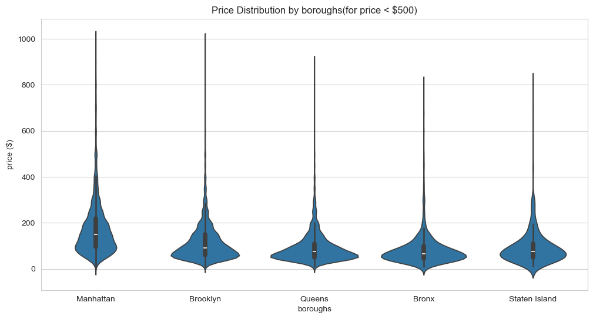

# NYC Airbnb Pricing and Demand Analysis

An end-to-end portfolio project analyzing the **NYC Airbnb 2019** market. The project combines a reproducible Python notebook with an interactive dashboard to explore how listing prices, supply, and review activity vary across boroughs, room types, and neighbourhoods.

## Live dashboard

**[Open the interactive NYC Airbnb dashboard](https://key07211.github.io/nyc-airbnb-market-explorer/)**

The dashboard supports:

- Borough and room-type filters
- Overview, neighbourhood strategy, and methodology views
- Interactive charts and tooltips
- Source inspection and data export

## Business question

How do pricing power and review activity differ across NYC boroughs, room types, and neighbourhoods, and how could those differences support a more balanced listing recommendation strategy?

## Dataset

- Source file: `AB_NYC_2019.csv`
- Historical snapshot: New York City Airbnb listings in 2019
- Original records: **48,895**
- Variables used: borough, neighbourhood, room type, nightly price, minimum nights, availability, review count, last review date, and reviews per month

## Project workflow

1. Loaded and profiled the original dataset with pandas.
2. Audited missing values, duplicates, and extreme values.
3. Filled missing `reviews_per_month` values with zero review activity.
4. Removed listings with a zero nightly price or a minimum stay above 365 nights.
5. Created review-activity and reliability indicators.
6. Compared price distributions across boroughs and room types.
7. Evaluated neighbourhood-level pricing and review activity using minimum sample-size rules.
8. Built and published an interactive portfolio dashboard with GitHub Pages.

After cleaning, **48,870 listings** remained. The process removed 25 unrealistic pricing or minimum-stay records, and no duplicate listing IDs were found.

## Key findings

### 1. Manhattan has the strongest pricing power

The overall cleaned-market median nightly price is **$106**. Borough-level median prices show a clear geographic premium:

| Borough | Median nightly price | Listings |
|---|---:|---:|
| Manhattan | $150 | 21,654 |
| Brooklyn | $90 | 20,089 |
| Queens | $75 | 5,664 |
| Staten Island | $75 | 373 |
| Bronx | $65 | 1,090 |

Manhattan also has the widest price dispersion and the largest concentration of high-price listings. Brooklyn is the second-largest market and contains several mid-to-high-price areas.



### 2. Entire homes command the highest median prices

`Entire home/apt` is the highest-priced room type in every borough. The premium is especially visible in Manhattan:

| Borough | Entire home/apt | Private room | Shared room |
|---|---:|---:|---:|
| Manhattan | $191 | $90 | $69 |
| Brooklyn | $145 | $65 | $36 |
| Queens | $120 | $60 | $37 |
| Bronx | $100 | $54 | $40 |
| Staten Island | $100 | $50 | $30 |

These results indicate pricing power, not confirmed profitability, because the dataset does not contain bookings, fees, taxes, or operating costs.

### 3. Reliable premium neighbourhoods are concentrated in Manhattan

To avoid rankings driven by one or two unusual listings, neighbourhood price comparisons require at least **30 listings**. Under this rule, the highest median nightly prices are concentrated in neighbourhoods such as:

- Tribeca — **$295** median nightly price
- NoHo — **$250**
- Flatiron District — **$225**
- Midtown — **$210**
- West Village and Financial District — **$200**

The geographic analysis reinforces the same pattern: higher-price listings are concentrated in Manhattan and selected nearby Brooklyn neighbourhoods.

### 4. Higher price does not imply stronger review activity

For listings with at least five historical reviews, average monthly review activity is:

| Room type | Average reviews per month | Listings |
|---|---:|---:|
| Private room | 1.99 | 11,549 |
| Shared room | 1.95 | 540 |
| Entire home/apt | 1.73 | 13,520 |

The correlation between nightly price and total reviews is **-0.04**, while the correlation between price and reviews per month is **-0.05**. Both are close to zero. Expensive listings therefore do not automatically show stronger review activity in this dataset.

This is an observed association, not a causal estimate. Borough, room type, listing age, and other factors are not controlled in the simple correlation.

### 5. Recommendation strategy should balance price and activity

A price-only strategy would overemphasize the most expensive Manhattan listings. A more credible recommendation approach also considers review activity, affordability, and sample reliability.

Neighbourhoods combining above-median price and above-median review activity include Financial District, Midtown, Theater District, Hell's Kitchen, Gowanus, Arverne, and Rockaway Beach. These areas illustrate that useful recommendation candidates can come from both premium and more affordable markets.

## Metric definitions and limitations

- **Reviews per month** is used only as a proxy for market attention. It is not a direct measure of bookings, occupancy, demand, or guest satisfaction.
- **Recently reviewed** means the listing received a review between July 8, 2018 and the latest review date in the snapshot, July 8, 2019. It does not prove that a listing is currently active.
- **Review-reliable listing** means a listing has at least five reviews. This improves stability but excludes newer listings.
- `365 - availability_365` is not treated as booked nights. Public calendar unavailability can reflect host blocks, preparation time, platform restrictions, or other non-booking reasons.
- Revenue and profit are not estimated because confirmed bookings, fees, taxes, and host operating costs are unavailable.
- The dataset is a historical 2019 snapshot and should not be interpreted as the current NYC Airbnb market.

## Tools used

- Python
- pandas and NumPy
- seaborn and Matplotlib
- Jupyter Notebook
- Interactive HTML/JavaScript dashboard
- Git and GitHub Pages

## Repository contents

| File | Purpose |
|---|---|
| [`airbnb_analysis.ipynb`](./airbnb_analysis.ipynb) | Data cleaning, exploratory analysis, visualizations, and conclusions |
| [`AB_NYC_2019.csv`](./AB_NYC_2019.csv) | Source dataset |
| [`Interactive Dashboard`](./https://key07211.github.io/nyc-airbnb-market-explorer/) | Published interactive dashboard |
| [`A1violinplot.png`](./A1violinplot.png) | Borough price-distribution visualization |
| [`New_York_City_.png`](./New_York_City_.png) | NYC map asset used by the notebook |

## Run the notebook locally

```bash
pip install pandas numpy seaborn matplotlib pillow jupyter
jupyter notebook airbnb_analysis.ipynb
```

Place the notebook, CSV file, and image assets in the same directory before running all cells.

## Main conclusion

NYC Airbnb pricing power is concentrated in Manhattan and selected Brooklyn neighbourhoods, particularly for entire-home listings. Review activity follows a different pattern: private rooms are more review-active among mature listings, and price has almost no unconditional correlation with review activity. A useful recommendation strategy should therefore combine pricing power with review signals, affordability, and sample reliability rather than simply promoting the most expensive listings.
